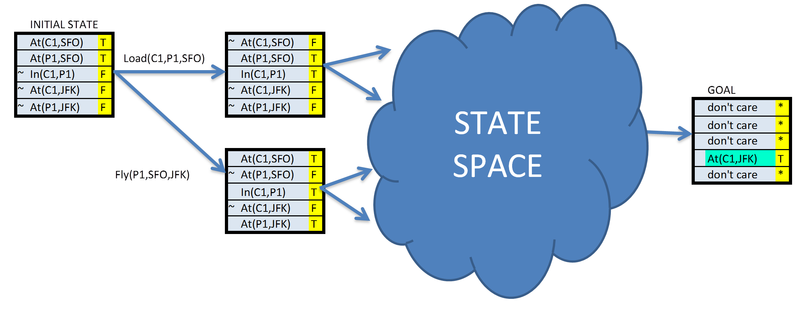

# Cargo Logistics System

## Synopsis

In this project, I've implemented a Planning Search Agent that finds the most efficient path to move cargos from their departing to their destination airports with limited airplanes, using Uninformed Planning Searches (Breadth-First Search, Depth-First Search, Uniform-Cost Search) and Informed Planning Searches (A* Searches with different heuristics). Since there is no simple distance heuristic to aid the A* Search agents, I've implemented domain-independent heuristics.


>Progression planning problems can be 
solved with graph searches such as breadth-first, depth-first, and A*, where the 
nodes of the graph are "states" and edges are "actions".  A "state" is the logical 
conjunction of all boolean ground "fluents", or state variables, that are possible 
for the problem using Propositional Logic. For example, we might have a problem to 
plan the transport of one cargo, C1, on a single available plane, P1, from one airport to another, SFO to JFK.

In this simple example, there are five fluents, or state variables, which means our state 
space could be as large as . Note the following:
>- While the initial state defines every fluent explicitly, in this case mapped to **TTFFF**, the goal may be a set of states.  Any state that is `True` for the fluent `At(C1,JFK)` meets the goal.
>- The fluents here are mapped to a simple string representing the boolean value of each fluent in the system, e.g. **TTFFTT...TTF**.  This will be the state representation in 
the `AirCargoProblem` class and is compatible with the `Node` and `Problem` 
classes, and the search methods in the AIMA library.  


## Environment

Here is my [environment file](https://github.com/vinny-palumbo/Cargo-Logistics-System/blob/master/environment.yaml). To clone my environment execute: `conda env create -f environment.yaml`


## Results

To generate a plan and statistics for one of the problems using one of the 10 Uniformed or Informed Planning Searches, execute: `python run_search.py -m`, and choose from the following options


Here are the generated optimal plans for 3 Air Cargo problems.

Air Cargo Action Schema:
```
Action(Load(c, p, a),
	PRECOND: At(c, a) ∧ At(p, a) ∧ Cargo(c) ∧ Plane(p) ∧ Airport(a)
	EFFECT: ¬ At(c, a) ∧ In(c, p))
Action(Unload(c, p, a),
	PRECOND: In(c, p) ∧ At(p, a) ∧ Cargo(c) ∧ Plane(p) ∧ Airport(a)
	EFFECT: At(c, a) ∧ ¬ In(c, p))
Action(Fly(p, from, to),
	PRECOND: At(p, from) ∧ Plane(p) ∧ Airport(from) ∧ Airport(to)
	EFFECT: ¬ At(p, from) ∧ At(p, to))
```

- Problem 1 initial state and goal:
```
Init(At(C1, SFO) ∧ At(C2, JFK) 
	∧ At(P1, SFO) ∧ At(P2, JFK) 
	∧ Cargo(C1) ∧ Cargo(C2) 
	∧ Plane(P1) ∧ Plane(P2)
	∧ Airport(JFK) ∧ Airport(SFO))
Goal(At(C1, JFK) ∧ At(C2, SFO))
```
Solution:
```
Load(C1, P1, SFO)
Load(C2, P2, JFK)
Fly(P1, SFO, JFK)
Fly(P2, JFK, SFO)
Unload(C1, P1, JFK)
Unload(C2, P2, SFO)
```
- Problem 2 initial state and goal:
```
Init(At(C1, SFO) ∧ At(C2, JFK) ∧ At(C3, ATL) 
	∧ At(P1, SFO) ∧ At(P2, JFK) ∧ At(P3, ATL) 
	∧ Cargo(C1) ∧ Cargo(C2) ∧ Cargo(C3)
	∧ Plane(P1) ∧ Plane(P2) ∧ Plane(P3)
	∧ Airport(JFK) ∧ Airport(SFO) ∧ Airport(ATL))
Goal(At(C1, JFK) ∧ At(C2, SFO) ∧ At(C3, SFO))
```
Solution:
```
Load(C1, P1, SFO)
Load(C2, P2, JFK)
Load(C3, P3, ATL)
Fly(P1, SFO, JFK)
Fly(P2, JFK, SFO)
Fly(P3, ATL, SFO)
Unload(C3, P3, SFO)
Unload(C2, P2, SFO)
Unload(C1, P1, JFK)
```
- Problem 3 initial state and goal:
```
Init(At(C1, SFO) ∧ At(C2, JFK) ∧ At(C3, ATL) ∧ At(C4, ORD) 
	∧ At(P1, SFO) ∧ At(P2, JFK) 
	∧ Cargo(C1) ∧ Cargo(C2) ∧ Cargo(C3) ∧ Cargo(C4)
	∧ Plane(P1) ∧ Plane(P2)
	∧ Airport(JFK) ∧ Airport(SFO) ∧ Airport(ATL) ∧ Airport(ORD))
Goal(At(C1, JFK) ∧ At(C3, JFK) ∧ At(C2, SFO) ∧ At(C4, SFO))
```
Solution:
```
Load(C1, P1, SFO)
Load(C2, P2, JFK)
Fly(P1, SFO, ATL)
Load(C3, P1, ATL)
Fly(P2, JFK, ORD)
Load(C4, P2, ORD)
Fly(P2, ORD, SFO)
Fly(P1, ATL, JFK)
Unload(C4, P2, SFO)
Unload(C3, P1, JFK)
Unload(C2, P2, SFO)
Unload(C1, P1, JFK)
```

The plans where generated using Uninformed Planning Searches (Breadth-First Search, Depth-First Search, Uniform-Cost Search) and Informed Planning Searches (A* Searches with different heuristics). Here are some statistics to compare the efficiency and speed of those planning searches:


Depth-First is the only Planning Search that didn't generate optimal plans, althought it is the fastest.

The A* search that takes the shortest time to solve the planning problems is the one with the "ignore preconditions" heuristic, which estimates the minimum number of actions that must be carried out from the current state in order to satisfy all of the goal conditions by ignoring the preconditions required for an action to be executed. The other A* search with the "level-sum" heuristics uses a planning graph representation of the problem state space to estimate the sum of all actions that must be carried out from the current state in order to satisfy each individual goal condition. This second A* search requires building a planning graph representation, so is way more computationally expensive than the first one, which only consists of 7 lines of codes. Indeed, the second A* search took 1153 seconds to solve the third problem, more than 30 times the 23.56 seconds it took for the first A* search to solve that same problem. 

The planning graph is somewhat complex, but is useful in planning because it is a polynomial-size approximation of the exponential tree that represents all possible paths. The planning graph can be used to provide automated admissible heuristics for any domain.

>*Planning Graph example from the AIMA book*
>